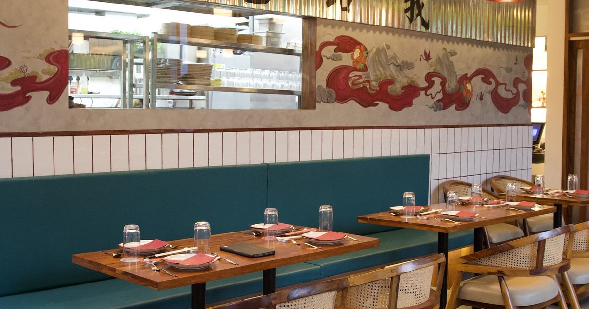

# Bao To Me Website

**A fast, visual restaurant website for Bao To Me, a Pan Asian kitchen in
Koramangala, Bangalore.**


This repo is the production source for a restaurant site: food photography,
menu structure, reviews, press, reservation paths, local SEO, and performance
work all in one static page.

Live site: **https://bao-to-me-website.vercel.app**



---

## See it run in 30 seconds

No build step. No framework. No package install.

```bash
git clone https://github.com/newbie1668/bao-to-me-website.git
cd bao-to-me-website
open index.html
```

You can also serve it with any static server if you want local URLs to behave
more like production.

> **New to this?** A few words you'll see below:
> *static site* = plain files the browser can open · *schema.org* = structured
> data that helps search engines understand the restaurant · *OG image* = the
> preview image shown when someone shares the link.

---

## What's inside

| Piece | What it does |
| --- | --- |
| `index.html` | The complete restaurant website. |
| `context/menu/` | Menu source material and food assets. |
| `context/menu/CATALOGUE/` | Dish photography used by the menu. |
| `context/photos/` | Space and food photography. |
| `context/brand/` | Brand source material. |
| `context/press/` | Press references. |
| `context/location/` | Location and opening-hours context. |
| `og-image.jpg` | Social sharing image. |
| `CHANGELOG.md` | Release history across content, UX, SEO, and performance. |

---

## How it fits together

```text
Brand assets + food photos + menu context
   |
   v
Single-page restaurant site
   |
   +--> menu and dish discovery
   +--> reservations and contact
   +--> reviews and press proof
   +--> schema.org local SEO
```

- The page prioritizes mobile diners deciding whether to visit or reserve.
- The menu uses real dish photography instead of placeholder content.
- Reviews and press create trust before the call to action.
- Structured data helps search engines read the business as a restaurant, not
  just a generic webpage.

---

## Product read

- **Problem:** A restaurant needs to convert intent quickly: what is this
  place, does the food look good, where is it, and how do I book?
- **User:** Diners in Bangalore deciding whether to visit, reserve, or share
  the restaurant with someone else.
- **Product bet:** A focused static site with strong visual assets, menu
  clarity, reviews, press, and local SEO can do the job without a CMS.
- **What shipped:** A responsive one-page site with real food photography,
  reservation CTAs, Google Maps, reviews, press, Open Graph metadata, and
  schema.org restaurant data.
- **What it proves:** I can ship a practical customer-facing website with
  content staging, business context, mobile polish, and SEO hygiene.

---

## Product details

| Area | What shipped |
| --- | --- |
| Menu | Categorized menu, dish photography, weekend specials, dietary indicators. |
| Reservations | Book, WhatsApp, call, and map CTAs tuned for mobile. |
| Trust | Review highlights, press mentions, and social proof. |
| SEO | Canonical URL, Open Graph, Twitter Card, favicon set, schema.org restaurant data. |
| Performance | Optimized images, lean static delivery, reduced layout shift. |
| Mobile UX | Tap targets, compressed menu cards, carousel press/review sections. |

---

## Release highlights

- **v1.5.5:** Mobile menu grid made denser so more dishes fit per screen.
- **v1.5.4:** Added live Google and Zomato review highlights.
- **v1.5.3:** Converted press cards into a mobile-friendly carousel.
- **v1.5.0:** Added full menu photography, weekend specials, refreshed space
  gallery, favicon set, and optimized OG image.
- **v1.1.0:** Added accessibility, SEO, structured data, and performance fixes.

Full history is in [`CHANGELOG.md`](./CHANGELOG.md).

---

## Deploy

Because this is a static site, deployment is simple:

1. Push to GitHub.
2. Import the repo into Vercel.
3. Deploy.

The production site is just the repository contents served as static assets.

---

## Who's behind this

Built by **Foo Ming Li**, a product manager in London. I used this project as a
practical client-style build: take real brand/menu assets, turn them into a
usable customer journey, and keep improving the parts that matter on mobile.

Reach out on [LinkedIn](https://www.linkedin.com/in/fooming/) if you want to
talk product, AI-assisted building, or small-business web experiences that do
their job without unnecessary machinery.
